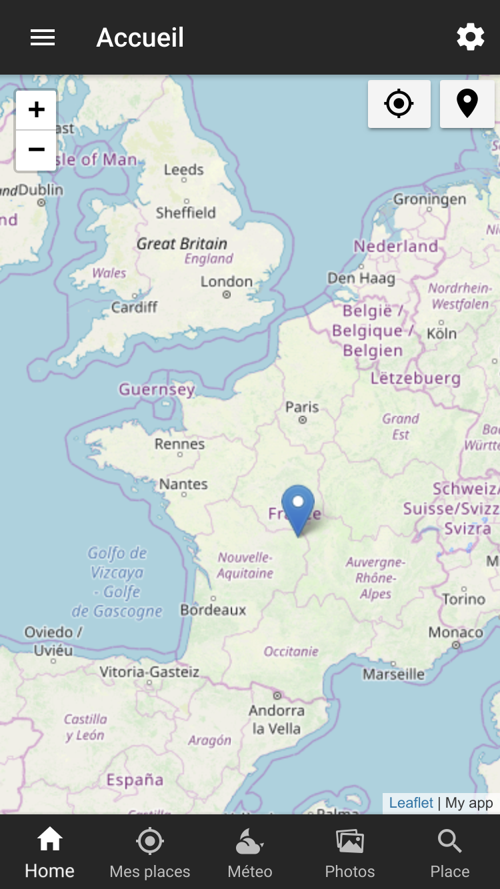

# ionicApplication

The main objective of this project is to use the native functions of the phone, namely, geolocation, camera, open source map integration, persistent data storage and also the use of external APIs.
In this application, I use the following API's:
* [open weather map](https://openweathermap.org/api) for the weather
* [pixabay](https://pixabay.com/api/docs/) for photos 


When you start the app, you see a map centering around your location, with a marker permanently fixed to the center of map. To achieve this, I use cordova-plugin-nativegeocoder.

**Note: This project is under development.**

## App Preview

All app preview screenshots were taken by running `ionic serve --lab`.

- [Home page]()

  

## Features
  * Ionic 4.7.1
  * [node, npm](https://github.com/nodejs/)
  * [TypeScript](http://www.typescriptlang.org/)
  * [JS]()


## Install
  **Make sure you have Node version >= 10.15.3 and NPM >= 6.4.1 (node.js version used 10.15.3 and NPM v. 6.4.1)
  
  ```bash
  # Install Ionic
  npm install -g cordova ionic
  # Clone the repo
  $ git clone https://github.com/ouramdane19/ionicApplication.git
  -----
  # change directory to our repo
  cd ionicApplication
  -----
  # install the repo with npm
  npm
  -----
  # restore plugins and platforms
  cordova prepare
  -----
  # start the server 
  ionic serve
  # Build application
  ionic run android
  ```
  
  go to [http://localhost:8100](http://localhost:8100) in your browser
  
## Commands
  ```bash
  $ run ionic serve ( development )
  $ ionic cordova build android --> build files for android platform and generate apk 
  ```

## License

MIT
